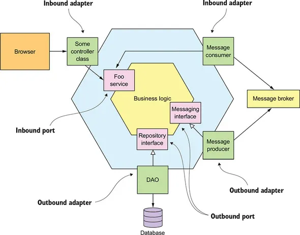
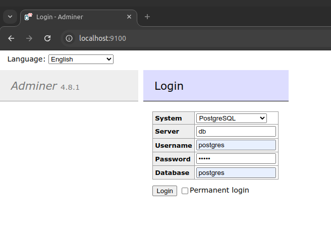
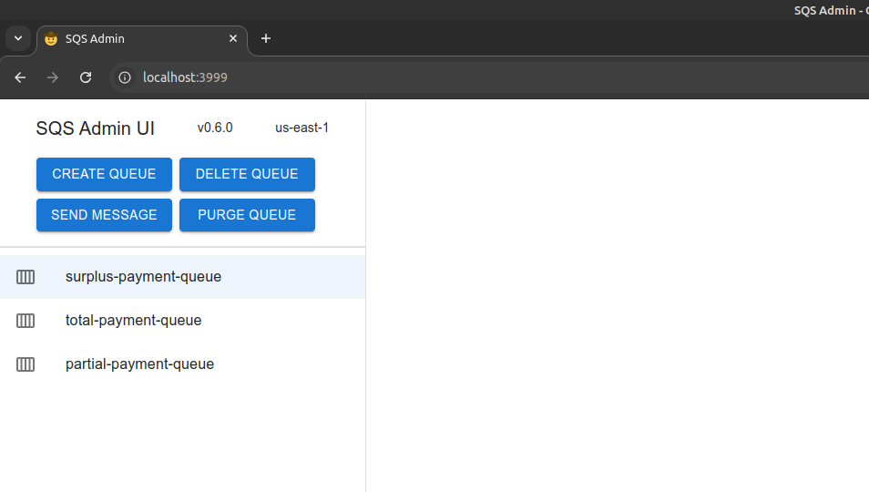

# Visão Geral da Solução

Este repositório contém a solução do desafio técnico para desenvolvedores Java da Compass.

# Sobra a Arquitetura Adotada

O projeto foi dividio em dois pacotes principais:
* `application` - contém os serviços de dominio e as portas de entrada e saída;
* `infrastructure` - contém os adaptadores de entrada e saída (JPA, REST e SQS) e as demais configurações.

O diagrama a baixo ilustra melhor a arquitetura adotada:



# Como Executar a Aplicação

Para rodar a aplicação basta executar o arquivo `start-me.sh` que encontra-se na raiz do projeto pelo terminal de comando. Este arquivo fará o build do projeto e executará um docker-compose inicializando banco, filas e a aplicação.

PS: Para executar o projeto é necessário que se tenha o `Docker 27.2.1+`, `Gradle 8.1+` e `Compose` devidamente instalados e configurados na máquina.

```shell
$ ./start-me.sh
```

Também é possível executar o projeto diretamente pelo Compose. Para isso basta entrar na pasta raiz do projeto e executar o comando abaixo:

PS: Neste caso, será necessário fazer o build do projeto manualmente antes da execução do comando.

```shell
$ docker compose up
```

Além da infraestrutura necessária para executar a aplicação, também são inicializados alguns clientes para facilitar o acompanhamento do seu funcionamento. Segue eles:

### Adminer

Cliente para acompanhar e manipular o bancos de dados relacionais: [http://localhost:9100/](http://localhost:9100/)



Credenciais:
  * **Username:** postgres
  * **Password:** admin

### SQS Admin

Cliente para acompanhar e manipular as filas SQS: [http://localhost:3999/](http://localhost:3999/)



Para usar o SQS Admin não é necessário o uso de credenciais de acesso.

Após a inicialização dos containers a aplicação ficará disponível para testes em: [http://localhost:8080/api/swagger-ui/index.html](http://localhost:8080/api/swagger-ui/index.html)

# Como Parar a Aplicação

Executar o arquivo `stop-me.sh` ou o commando `docker compose down` na pasta raiz do projeto.

```shell
$ ./stop-me.sh
```

```shell
$ docker compose down
```
